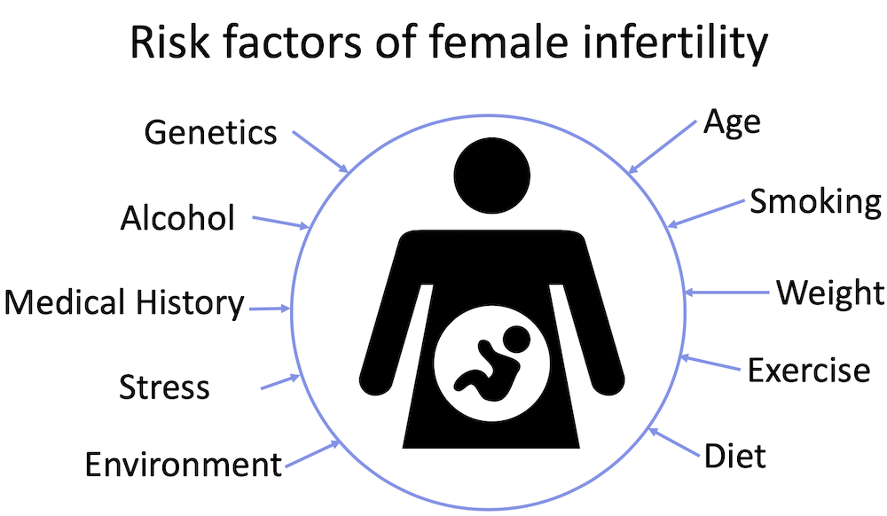

**********************************************
# Predicting Infertility from Self-Reported Data
**********************************************

#### Author: Rosie M Martinez, ScD, MPH
#### Website: https://github.com/rosiemin/dsi-capstone1

# Background
Human infertility is a complex disorder that is becoming more prevalent. In 2010, an estimated 48.5 million couples worldwide were unable to have a child after five years of trying to conceive. Worldwide 1 in 6 couples have troubles getting pregnant or sustaining their pregnancy and approximately 6.9 million American women struggle with issues of infertility. According to the National Center for Health Statistics, in the United States 12.1% of women aged 15-44 have impaired fecundity (the ability to have kids) and 6.7% of married women in the same age range are infertile.

[ source](https://www.stanfordchildrens.org/content-public/pdf/national-infertility-week-stanford-childrens.pdf)

Infertility is influenced by a broad range of physical, anatomical, hormonal, genetic and environmental stressors. About 1/3 of infertility is attributed to female issues, 1/3 is attributed to male issues, and 1/3 is attributed to unknown factors. The burden of infertility high and remains an ongoing global reproductive health issue.

The clinical diagnosis of infertility is defined as the failure to conceive within 12 months and affects 7% to 8% of reproductive-aged American women. The American Society for Reproductive Medicine recommends that a woman should consult her physician if she is under 35 years of age and has been trying to conceive for more than 12 months or over 35 years of age and has been trying for 6 or more months.

### Question: Can I predict infertility among women based on self-reported risk factor data?

# Data

[ source](https://www.cdc.gov/nchs/nhanes/)

The National Health and Nutrition Examination Survey, or NHANES as it is better known, is a program designed to assess the health and nutritional status of adults and children in the United States. The survey examines a nationally representative sample of about 5,000 persons each year. These persons are located in counties across the country, 15 of which are visited each year. The NHANES interview includes demographic, socioeconomic, dietary, and health-related questions. The examination component consists of medical, dental, and physiological measurements, as well as laboratory tests administered by highly trained medical personnel.

While we infertility is not only a “female” issue, for the purposes of this capstone, I will be focusing on infertility among women. In this data, there are many different datasets based on questionnaires given, but I will be focusing my project on those questions dealing with the known risk factors of infertility, including

* Age
* Race/Ethnicity
* BMI (body mass index)
*	Pre-existing thyroid issues, STIs, and pelvic inflammatory disease
*	Physical activity, based on the CDC’s recommendation (150 min moderate of 75 min of vigorous exercise per week)
*	Alcohol consumption
*	Smoking
*	Irregular periods

For the purposes of this analysis I have excluded women who have had a hysterectomy, or have had uterine, cervical, or ovarian cancer.

# Analysis

'''                           Logit Regression Results                           
==============================================================================
Dep. Variable:              fert_stat   No. Observations:                 1011
Model:                          Logit   Df Residuals:                      993
Method:                           MLE   Df Model:                           17
Date:                Tue, 12 Feb 2019   Pseudo R-squ.:                 0.04684
Time:                        17:12:26   Log-Likelihood:                -333.50
converged:                       True   LL-Null:                       -349.89
                                        LLR p-value:                   0.01203
==============================================================================================
                                 coef    std err          z      P>|z|      [0.025      0.975]
----------------------------------------------------------------------------------------------
const                         -4.1921      0.603     -6.949      0.000      -5.375      -3.010
age                            0.0429      0.011      3.735      0.000       0.020       0.065
alcohol                        0.0282      0.018      1.593      0.111      -0.006       0.063
bmi                            0.0152      0.013      1.150      0.250      -0.011       0.041
eth_african_american          -0.1330      0.298     -0.446      0.656      -0.718       0.452
eth_asian                     -0.0125      0.376     -0.033      0.974      -0.749       0.724
eth_mexican_hispanic          -0.2306      0.326     -0.708      0.479      -0.869       0.408
eth_mixed_race                 0.4088      0.497      0.823      0.410      -0.565       1.382
eth_other_hispanic             0.0537      0.337      0.159      0.874      -0.607       0.715
thyroid_yes                    0.0675      0.340      0.199      0.843      -0.598       0.733
sti_yes                       -0.1457      0.309     -0.472      0.637      -0.751       0.460
piv_yes                        1.1658      0.401      2.904      0.004       0.379       1.952
irr_periods_yes               -0.4636      0.305     -1.521      0.128      -1.061       0.134
physical_activity_moderate    -0.0574      0.332     -0.173      0.863      -0.707       0.593
physical_activity_some         0.1707      0.230      0.741      0.459      -0.281       0.622
physical_activity_vigorous     0.6370      0.521      1.223      0.221      -0.384       1.658
smoke_current                 -0.3359      0.313     -1.073      0.283      -0.949       0.278
smoke_former                   0.0735      0.307      0.239      0.811      -0.529       0.676
=============================================================================================='''

# Discussion

# Strengths & Limitations

# Future Steps
