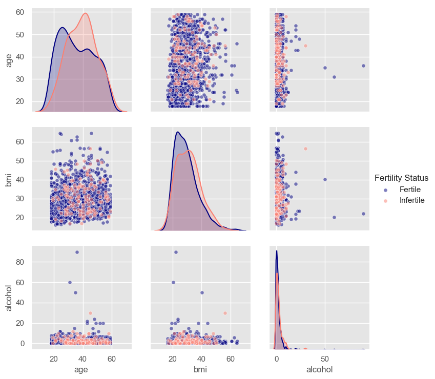
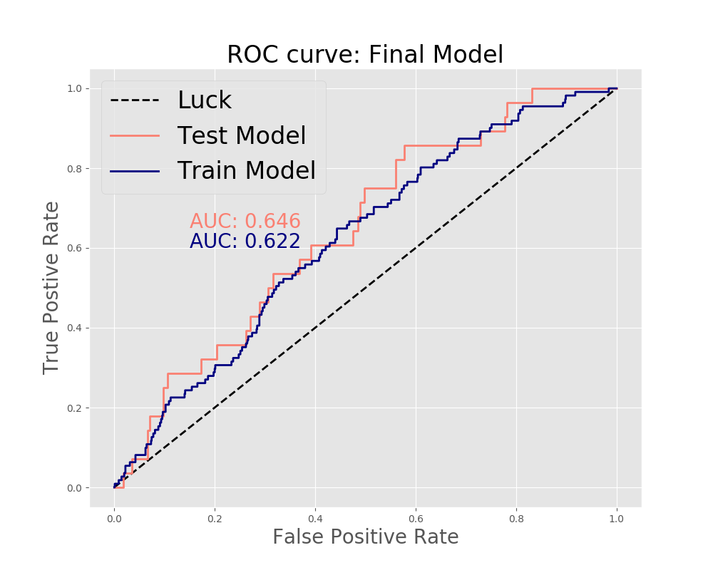
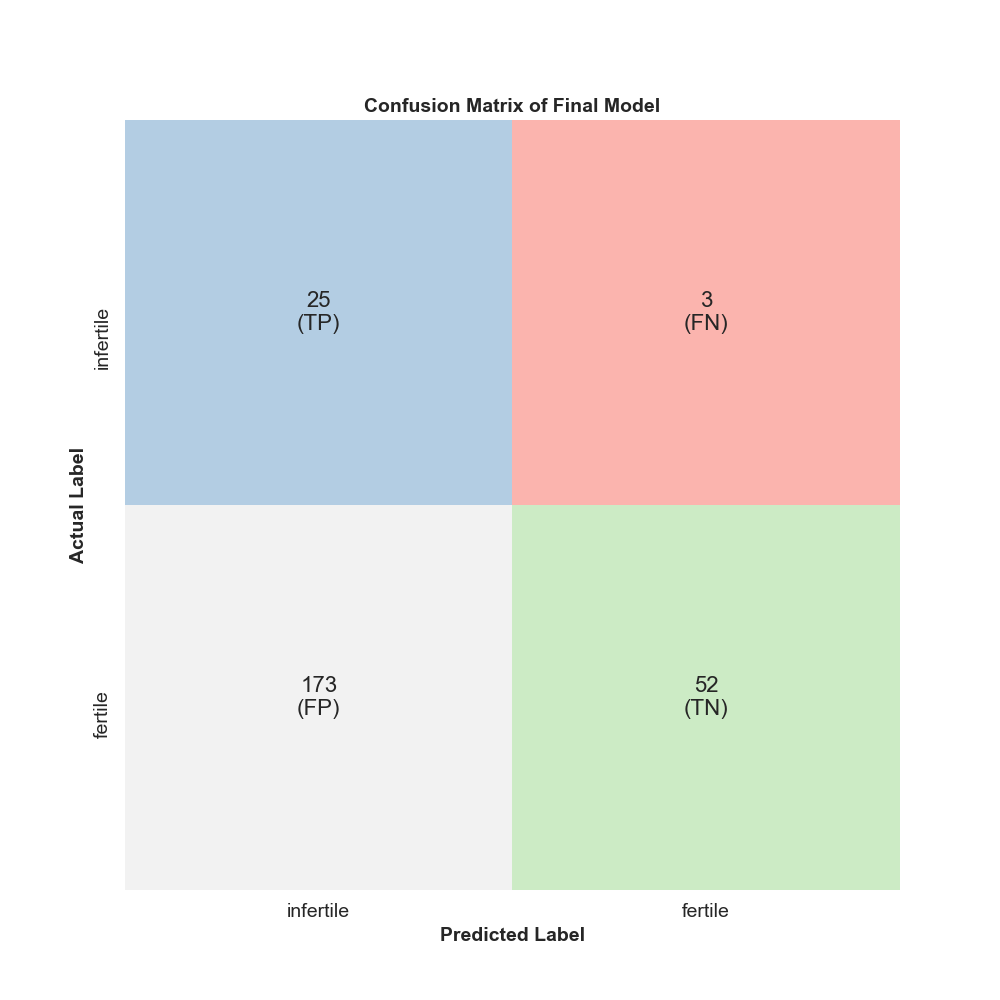

**********************************************
# Predicting Infertility from Self-Reported Data
**********************************************

#### Author: Rosie M Martinez, ScD, MPH
#### Website: https://github.com/rosiemin/dsi-capstone1

# Background
Human infertility is a complex disorder that is becoming more prevalent. In 2010, an estimated 48.5 million couples worldwide were unable to have a child after five years of trying to conceive. Worldwide 1 in 6 couples have troubles getting pregnant or sustaining their pregnancy and approximately 6.9 million American women struggle with issues of infertility. According to the National Center for Health Statistics, in the United States 12.1% of women aged 15-44 have impaired fecundity (the ability to have kids) and 6.7% of married women in the same age range are infertile.

<p align="center">


[ source](https://www.stanfordchildrens.org/content-public/pdf/national-infertility-week-stanford-childrens.pdf)
</p>


Infertility is influenced by a broad range of physical, anatomical, hormonal, genetic and environmental stressors. About 1/3 of infertility is attributed to female issues, 1/3 is attributed to male issues, and 1/3 is attributed to unknown factors. The burden of infertility high and remains an ongoing global reproductive health issue.

The clinical diagnosis of infertility is defined as the failure to conceive within 12 months and affects 7% to 8% of reproductive-aged American women. The American Society for Reproductive Medicine recommends that a woman should consult her physician if she is under 35 years of age and has been trying to conceive for more than 12 months or over 35 years of age and has been trying for 6 or more months.

### Question: Can I predict infertility among women based on self-reported risk factor data?

# Data

[ source](https://www.cdc.gov/nchs/nhanes/)

The National Health and Nutrition Examination Survey, or NHANES as it is better known, is a program designed to assess the health and nutritional status of adults and children in the United States. The survey examines a nationally representative sample of about 5,000 persons each year. These persons are located in counties across the country, 15 of which are visited each year. The NHANES interview includes demographic, socioeconomic, dietary, and health-related questions. The examination component consists of medical, dental, and physiological measurements, as well as laboratory tests administered by highly trained medical personnel.

While we infertility is not only a “female” issue, for the purposes of this capstone, I will be focusing on infertility among women. In this data, there are many different datasets based on questionnaires given, but I will be focusing my project on those questions dealing with the known risk factors of infertility, including
<p align="center">

</p>

* Age
* Race/Ethnicity
* BMI (body mass index)
*	Pre-existing thyroid issues, STIs, and pelvic inflammatory disease
*	Physical activity, based on the CDC’s recommendation (150 min moderate of 75 min of vigorous exercise per week)
*	Alcohol consumption
*	Smoking
*	Irregular periods

For the purposes of this analysis I have excluded women who have had a hysterectomy, or have had uterine, cervical, or ovarian cancer.

# Analysis

#### How did I define infertility?
In the NHANES dataset, there are two questions asked:
* “Have you/spouse ever attempted to become pregnant over a period of at least a year without becoming pregnant?”
* “Have you or your spouse ever been to a doctor or other medical provider because you or she has been unable to become pregnant?”

Those participants that said “Yes” to one of either of the two questions are infertile and those that said “No” as fertile.

### EDA:
*note, I'm only showing EDA on those variables I kept in my final model*

#### Continuous Variables: Age, BMI, Alcohol
<p align="center">


</p>


#### Categorical Variables: STIs (yes/no), Irregular Periods (yes/no), Smoking Status (Current/Former/Never)
<p align="center">

</p>

### Model Training:

### Final Model Assessment:

```python
Coefficients from the final holdout model using Stats Models
                      coef     P>|z|
Intercept          -4.0289     0.000      
Age                 0.0595     0.005      
Alcohol             0.0750     0.164     
BMI                -0.0116     0.627      
STI_yes            -0.5830     0.378     
Irr Periods_yes    -0.9072     0.109      
Current Smoke       0.0481     0.926    
Former Smoke        0.7921     0.109     
```
Because age is significant, we can look at the exp(0.0595) = 1.06

** Holding all else constant, on average, with a one year increase in age, the odds increases by 6% among those that are infertile compared to those that are fertile.**

<p align="center">

</p>

**The recall from my training model 0.910**

**The recall from my first test 0.893**

**The recall from my final hold out was 0.886**

<p align="center">

</p>


# Discussion


# Future Steps
* Re-do analysis including the other years that NHANES has available (approximately 10 more years worth of data).
*
