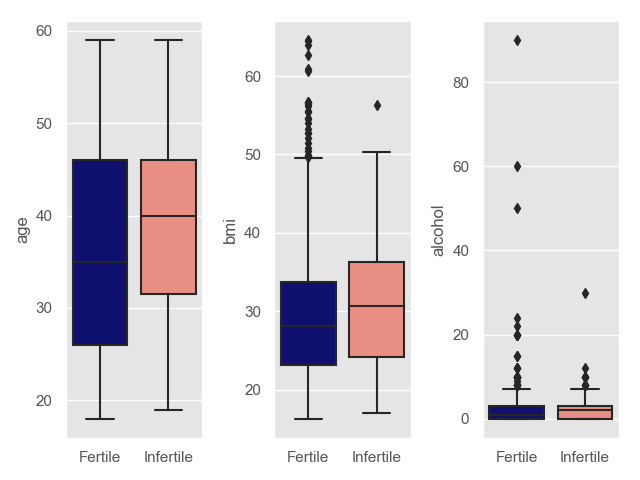
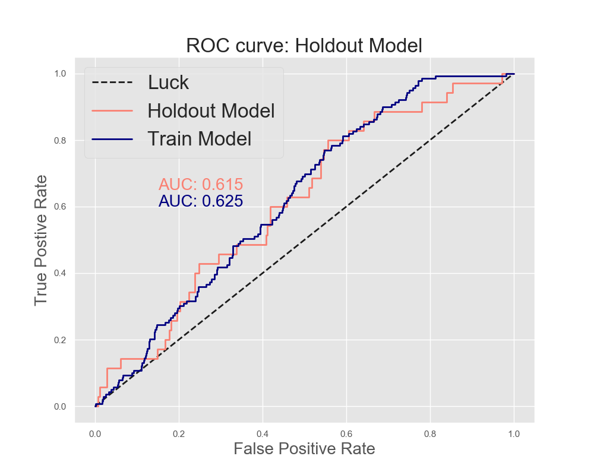
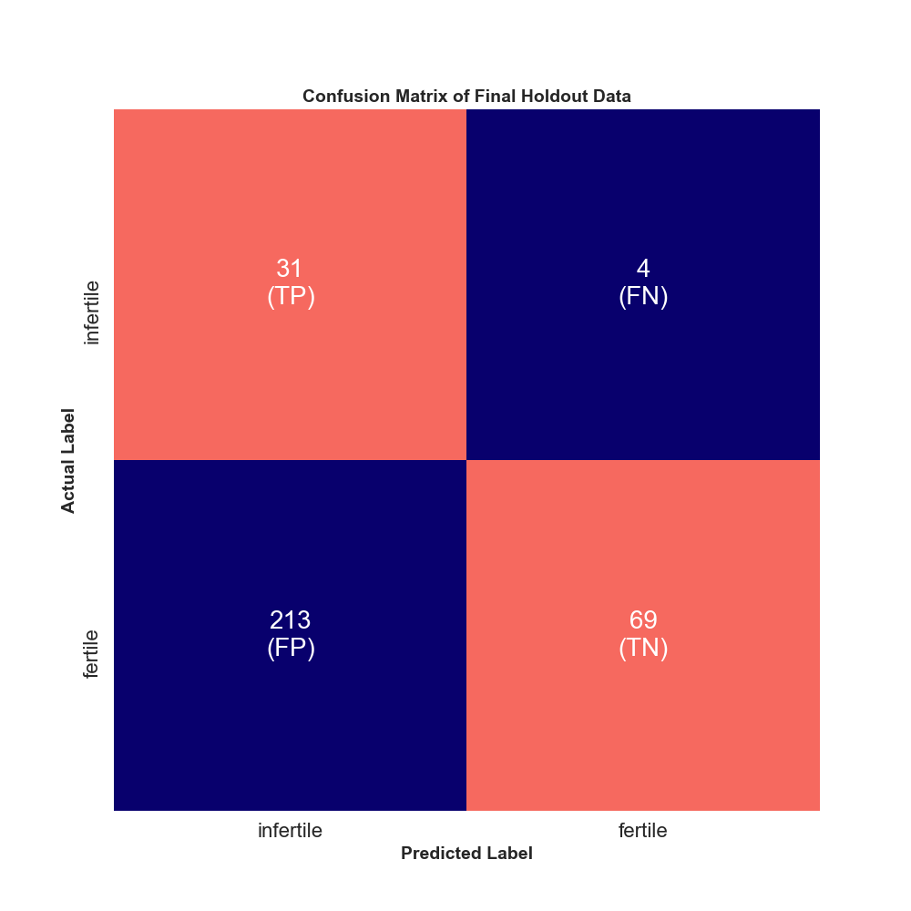

**********************************************
# Predicting Infertility from Self-Reported Data
**********************************************

#### Author: Rosie M Martinez, ScD, MPH
#### Website: https://github.com/rosiemin/dsi-capstone1
***
## Table of Contents
1. [Background](#Background)
2. [Data](#Data)
3. [Analysis](#Analysis)
    * [Outcome Definition](#How-did-I-define-infertility)
    * [EDA](#EDA)
        * [Continuous Variables](#Continuous-Variables)
        * [Categorical Variables](#Categorical-Variables)
    * [Model Training](#model-training)
        * [How did I choose my test metric?](#How-did-I-choose-my-test-metric)
    * [Final Model Assessment](#Final-Model-Assessment)
4. [Discussion](#discussion)
    * [Take Away](#Take-Away)
    * [Final Thoughts](#final-thoughts)  
    * [Future-steps](#future-steps)

# Background
Human infertility is a complex disorder that is becoming more prevalent. In 2010, an estimated 48.5 million couples worldwide were unable to have a child after five years of trying to conceive. Worldwide 1 in 6 couples have trouble getting pregnant or sustaining their pregnancy and approximately 6.9 million American women struggle with issues of infertility. According to the National Center for Health Statistics, in the United States 12.1% of women aged 15-44 have impaired fecundity (the ability to have kids) and 6.7% of married women in the same age range are infertile.

<p align="center">


[ source](https://www.stanfordchildrens.org/content-public/pdf/national-infertility-week-stanford-childrens.pdf)
</p>


Infertility is influenced by a broad range of physical, anatomical, hormonal, genetic and environmental stressors. About 1/3 of infertility is attributed to female issues, 1/3 is attributed to male issues, and 1/3 is attributed to unknown factors. The burden of infertility high and remains an ongoing global reproductive health issue.

The clinical diagnosis of infertility is defined as the failure to conceive within 12 months and affects 7% to 8% of reproductive-aged American women. The American Society for Reproductive Medicine recommends that a woman should consult her physician if she is under 35 years of age and has been trying to conceive for more than 12 months or over 35 years of age and has been trying for 6 or more months.

## Question: Can I predict infertility among women based on self-reported risk factor data?

# Data

[ source](https://www.cdc.gov/nchs/nhanes/)

The National Health and Nutrition Examination Survey, or NHANES as it is better known, is a program designed to assess the health and nutritional status of adults and children in the United States. The survey examines a nationally representative sample of about 5,000 persons each year. These persons are located in counties across the country, 15 of which are visited each year. The NHANES interview includes demographic, socioeconomic, dietary, and health-related questions. The examination component consists of medical, dental, and physiological measurements, as well as laboratory tests administered by highly trained medical personnel.

While we infertility is not only a “female” issue, for the purposes of this capstone, I will be focusing on infertility among women. In this data, there are many different datasets based on questionnaires given, but I will be focusing my project on those questions dealing with the known risk factors of infertility, including
<p align="center">

</p>

* Age
* Race/Ethnicity
* BMI (body mass index)
*	Pre-existing hormonal issues, STIs, and pelvic inflammatory disease
*	Physical activity
*	Alcohol consumption
*	Smoking
*	Irregular periods

For the purposes of this analysis I have excluded women who have had a hysterectomy, or have had uterine, cervical, or ovarian cancer.

# Analysis

#### How did I define infertility?
In the NHANES dataset, there are two questions asked:
* “Have you/spouse ever attempted to become pregnant over a period of at least a year without becoming pregnant?”
* “Have you or your spouse ever been to a doctor or other medical provider because you or she has been unable to become pregnant?”

Those participants that said “Yes” to one of either of the two questions are infertile and those that said “No” as fertile.

|                   	| Training Count 	| Training % 	| Test Count 	| Test % 	| Overall Count 	| Overall % 	|
|-------------------	|----------------	|------------	|------------	|--------	|---------------	|-----------	|
| Infertile (Y = 1) 	| 139            	| 11%        	| 25         	| 11%    	| 174           	| 11%       	|
| Fertile (Y = 0)   	| 1125           	| 89%        	| 282        	| 89%    	| 1407          	| 89%       	|

We can we that this is a binary outcome, therefore I will be performing **Logistic Regression** with fertility status as the outcome.

*note: This data is subject to class imbalance*

### EDA:
*note: I'm only showing EDA on those variables I kept in my final model*

#### Continuous Variables:
**Age, BMI, Alcohol**
<p align="center">


</p>


#### Categorical Variables:
**STIs (yes/no), Irregular Periods (yes/no), Smoking Status (Current/Former/Never)**
<p align="center">

</p>

### Model Training:
<p align="center">̨

</p>

#### How did I choose my test metric?
1. What is the question at hand?
2. What are the potential metrics?


|  	| Recall (TP/TP+FN) 	| Precision (TP/TP+FP) 	|
|------	|-----------------------------------------------------------------------------------------------------------------------------------------------------------------------------	|-------------------------------------------------------------------------------------------------------------------------------------------------------------------------------------------------------------------------------------------------------------------------------------------------------------------------------------------------------------------	|
| Pros 	|  Minimizes my false negatives (Telling someone they are fertile when actually they are infertile) 	| Minimizes my false positives (Telling someone they are infertile when actually they are fertile) 	|
|  	| When thinking about the emotional/monetary/and time a couple might spend and on top of that, not actually being able to concieve, it seems best to minimize false negatives 	| Potentially could reduce the amount of money going into tests 	|
| Cons 	| Most likely my false positives will take a hit and we will be having a lot more type 1 error 	| Assuming we are in a population of people who want to have kids, if we are minimizing the false positives, we aren’t necessarily minimizing the false negatives, so it will take more of a toll on couples if they think they are fertile but in fact they aren’t. This is especially true in those couples who are older and are already at risk of infertility. 	|
|  	| If a person wants to be more liberal with their knowledge of being “infertile” they might have a fun surprise waiting for them. 	| Most likely my false positives will take a hit and we will be having a lot more type 1 error 	|                                                                                                                                                                                            	|


Beyond this, we have to think about the other effects this can have on a couple.Infertility causes several effects in different types of personal health: physical, mental, emotional, psychological, social and even religious, in the couples that suffer from it. It’s one of the most important causes of depression, and its social, psychological and cultural consequences. [ source](https://pdfs.semanticscholar.org/75d6/fa1291e80cb867fd2fa07fc99aea1bbfb43d.pdf)


#### Based on this, I chose to reduce my false negatives, therefore I will be comparing recall between my models.

#### Other choices made from my K-fold CV analysis:
1. Class weights decided = 'balanced' or in my case 10:1
    * For every individual that was infertile, they are worth 10 fertile.
2. Threshold at which my predicted probabilities were decided = 0.4
    * Because I wanted to reduce my false negatives, I wanted to allow a few more false positives go by, so instead of having a default threshold of 0.5, I chose a threshold of 0.4.

### Final Model Assessment:

```python
Coefficients from the final holdout model using Stats Models
*Note, this does not take into account my chosen class weights or threshold previously mentioned*
                      coef     P>|z|
Intercept          -5.0404     0.000      
Age                 0.0394     0.047      
Alcohol             0.0087     0.881     
BMI                 0.0513     0.035      
STI_yes            -0.3440     0.599     
Irr Periods_yes    -0.1853     0.737      
Current Smoke      -0.0322     0.949    
Former Smoke       -0.7065     0.289     
```
Because age and BMI are significant, we can look at the exp(0.0394) = 1.04 (age), and exp(0.0513) = 1.05

***Interpretation of age***

**Holding all else constant, on average, with a one year increase in age, the odds increase by 4% among those that are infertile compared to those that are fertile.**

***Interpretation of BMI***

**Holding all else constant, on average, with a one unit increase in BMI, the odds increase by 5% among those that are infertile compared to those that are fertile.**

<p align="center">

</p>

* **The recall from my training data: 0.906**
* **The recall from my final holdout data: 0.886**

<p align="center">

</p>


# Discussion

### Take Away:
What can we take away from this analysis? Based on the above analysis, the probability that my model could correctly predict those individuals that were actually infertile was 0.886. That is, the model was retrieving the infertile individuals that should have been infertile.

### Final thoughts:
* If I examine any of the specific beta coefficients from my model (performed by stats models not sklearn), I can that age and bmi increase with an infertile outcome compared to fertile outcome. While these make sense, many of the other predictors do not, for instance, I would have expected a history of STIs, irregular periods, increase smoking intensity would have higher odds among the infertile group compare to the fertile group, but my model is not telling me this.
* I do have class imbalance in this analysis (only ~10% infertile), while I try to combat this by weighting my classes (Y = 1 vs Y = 0) differently. In an ideal situation, I would have a 50/50 split of my weights so I could correctly predict without having to bias my outcome variable.
* I was able to make sure that during my test-train splits and during my k-fold, I preserved the proportions of my outcome. Therefore if I observed 10% infertile in my overall dataset, after a test train split, I would still have 10% infertile in my train set and 10% infertile in my test set. The same goes for my k-fold splits.
* This data is mainly all self-reported, so these results may be subject to recall bias or mis-classification. The best scenario is that I am dealing with non-differential misclassification, therefore biasing my results towards the null, but in reality, I might have run into differential misclassification which could bias my results in either direction.


### Future Steps
* Re-do analysis including the other years that NHANES has available (approximately 10 more years worth of data). This will allow me to increase my sample size, which could, in turn, improve my power to detect
* Ideally getting real-world data on whether or not an individual is infertile based on a medical diagnosis rather than self-reported data.
* Continue to improve the model, there might be risk factors that I'm not including in this model or that were not available to me that might influence infertility more.


Acknowledgements: Thanks to the NHANES database provided by Center for Disease Control and Prevention and the National Center for Health Statistics
